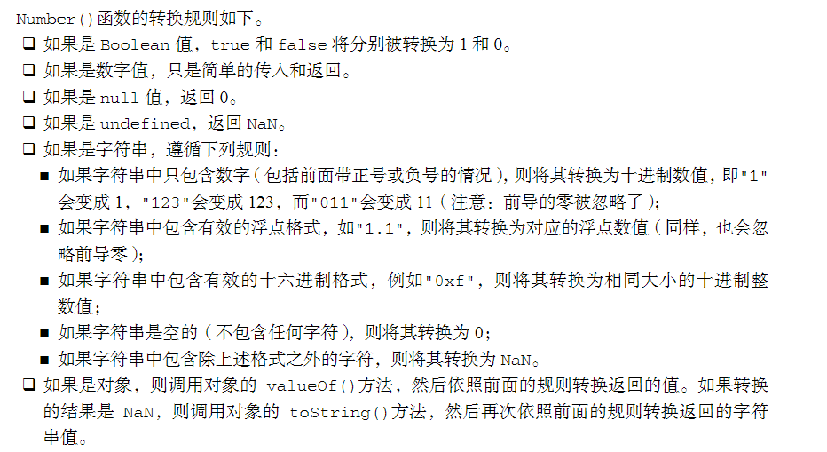
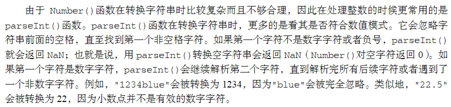
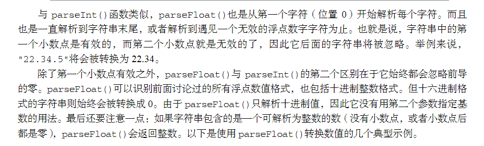
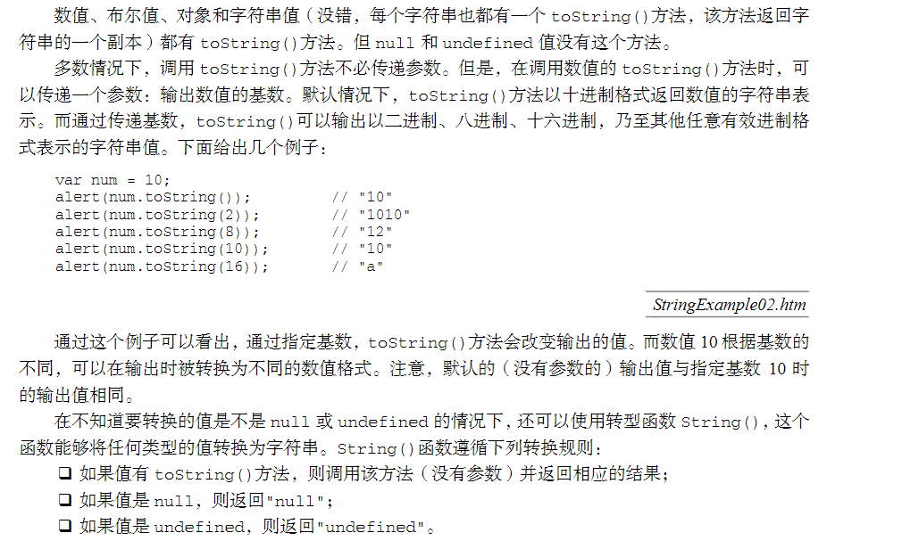

# 2.基本概念

## 2.1语法

### 2.1.1区分大小写

​	JavaScript中的一切都区分大小写。例如text和Text是不同的变量。

### 2.1.2标识符

​	标识符就是指变量，函数属性的名字。应遵循以下规则：

​	第一个自负必须是一个字母，下划线_，或一个美元符号$

​	其他字符可以是字母，下划线，数字，美元符号

​	标识符的字母也可以包含拓展的ASCII或Unicode字母字符，但不推荐这么做。

​	按照惯例，标识符用驼峰命名法，即第一个单词小写外，其他的每个单词的首字母大写，如firstApple，myCar

### 2.1.3注释

​	和C类似。

```js
//单行注释


/*
 *
 *    多行注释	
 *
 */
```

​	多行注释除开头结尾的``*``其他的``*``都可以省略，这样只是为了可读性

### 2.1.4严格模式

​	加入下面一行代码来开启严格模式。后面会有相关内容

```js
"use strict"
```

### 2.1.5语句

​	以``;``确定语句的结尾，如果省略则有解释器自动确定结尾，但不推荐这样做。

```js
sum = a + b; //;确定
sum = a + b  //自动确定
```

​	代码块用``{``和``}``包含

```js
if(a)
{
    sum = a + b;
    a = a - b;
}
```

## 2.2关键字和保留字

​	具有特殊作用的标志例如``if``,``for``等等就是关键字，故不可以自定义标识符为关键字的名字。另外还有一组保留字，虽然暂时没有特殊作用，但也不可以作为标识符。

## 2.3变量

​	js的变量是松散类型的，即可以保存所有类型的数据。定义变量使用``var``关键字。如

```js
var message;
```

​	定义以后没有初始化的变量汇报存一个特殊的值----``undefined``，也可以在定义时初始化变量，如

```js
var message = "hi";
```

​	var定义的变量是定义该变量的作用域的局部变量，函数结束后就会被销毁。

​	如果不加var则会创建一个全局变量。

​	一次定义多个变量用逗号隔开。且可以是不同类型的。如

```js
var number = 1,
    message = "hi",
    found = false;
```

## 2.4数据类型

​	js有五种基本数据类型：``Undefined`` ``Null`` ``Boolean`` ``Number`` ``String`` ，以及一种复杂数据类型 ``Object`` ，本质上由若干名值对构成。

### 2.4.1typeof操作符

​	返回操作对象对象的数据类型。

### 2.4.2Undefined类型

​	只有一个值undefined，当定义变量未初始化时就是这个值。

​	值为undefined的变量和未定义的变量不同。如

```js
var message;
console.log(message);//打印undefined
console.log(apple);//报错
```

### 2.4.3Null类型

​	Null类型也只有一个值的数据类型，这个是null，但是要注意的是对null使用typeof操作符返回的是"object"。另外undefined派生自null，因此这两者比较是相等的，即

```js
null == undefined   //true
```

​	在保存对象的变量还没有真正保存之前，应该赋值null。

### 2.4.4Boolean类型

​	Boolean值有两个，``true`` ``false`` ，虽然字面值只有两个，但所有数据类型都有与这两个值等价的其他值,可以用Boolean()转换。如：

```js
console.log(Boolean("abc"));//非空字符串 true
console.log(Boolean(""));//空字符串 false
console.log(Boolean(5.3));//非零数字 true
console.log(Boolean(0));//0和NaN  false
console.log(Boolean(NaN));
var obj;
console.log(Boolean(obj));//空对象 false
obj = { str: "abc" };
console.log(Boolean(obj));//非空对象 true
console.log(Boolean(undefined));//undefined false
```

### 2.4.5Number类型

(1)整数

​	可以用十进制赋值。

```js
var  num = 55;
```

​	可以开头加0来用八进制输入，如果后面的数字超过了7则会忽略前导零，当十进制处理。

```js
var  num = 045;//八进制45
var  num = 082;//十进制82
```

​	可以开头加0x来用十六进制输入。

```js
var num = 0x2f;
```

​	不论哪种方法赋值，在进行操作时，实际上都会转化成十进制。

(2)浮点数值

​	浮点数值必须包含小数点，且小数点后面必须有数字。小数点前面可有没有数字，但是不推荐。只能十进制输入。

```js
var num = 1.3;
var num = 0.1;
var num = .1;//可以，但不推荐
```

​	如果浮点数本身就是一个整数或者小数点后面没有数字，也认为是整数。

```js
var num = 1.;//整数1
var num = 1.0;//整数1
```

​	浮点数精度不如整数，不可以进行类似如下的判断。

```js
0.1+0.2==0.3 //false
```

(3)数值范围

​	范围的最大值Number.MAX_VALUE,这个值为1.7976931348623157e+308,范围的最小值Number.MIN_VALUE,这个值为5e-324。超过范围会被转化为NaN,超上限和下限分别为Infinity，-Infinity。这两个值不能进行算术运算。

(4)NaN

​	NaN是在应该返回数字时，没有任何一个值可以返回时的值，例如对数字除0。它有两个特点，NaN与任何数字进行任何运算还是NaN,NaN不等于任何数，包括自己。

```js
NaN == NaN; //false
```

​	可以利用isNaN()函数来判断一个参数是不是数值。注意：非数值的参数会尝试转化成数值，"10"，true 等等都认为是数值。"blue"之类的不可以转化的才会返回false。

(5)数值转化

有三个函数可以将非数值转化为数值：Number(),praseInt(),praseFloat()。

**Number()**



**praseInt()**



其可以接受第二个参数，决定用几进制转换里面的数值，默认十进制。

```js
praseInt("12",14) //十进制的16
```

**praseFloat()**



### 2.4.6String类型



### 2.4.7Object类型

可以用下面的语句定义一个Object类型的变量。

```js
var o = new Object();
var o = new Object;//可以省略括号但不推荐
```

## 2.5运算

### 2.5.1相等运算符

**==**和**!=**  (相等与不相等)

先转化再比较，其中Boolean与其他比较变为0/1，字符串与数值比较变为数值。

```js
10 == "10.0" //true
true == "1"  //true
```

**===**和**!==** (全相等与不全相等)

不转化直接比较，不同类型的一定是不===的，特别要注意的

```js
undefined == null //true
undefined === null //false，这俩是不同的值
```

### 2.5.2条件运算符

```js
var num = a>b?a:b; //和C++类似，前面的表达式为true则返回第一个值，否则返回第二个值
```

### 2.5.3赋值运算符

类似c++，js也有以下混合赋值运算 ``*=`` ``+=`` ``/=``  等等。

### 2.5.4逗号运算符

仍然是类似c++的一个运算

```js
var num = (1,2,3,4,5,0); //num为0
```

### 2.5.5空值合并运算符

我们将值既不是 `null` 也不是 `undefined` 的表达式称为“已定义的（defined）”。

`a ?? b` 的结果是：

-   如果 `a` 是已定义的，则结果为 `a`，

-   如果 `a` 不是已定义的，则结果为 `b`。

    ```js
    var a;
    var b = a ?? "mike";
    ```

### 2.5.6可选链操作符

**可选链**操作符( **`?.`** )允许读取位于连接对象链深处的属性的值，而不必明确验证链中的每个引用是否有效。

```js
var nestedProp = obj.first?.second;//即是first为null或undefined也不会导致错误，等价于
var nestedProp = obj.first && obj.first.second;
```

## 2.6语句

### 2.6.1if语句

和其他语言类似,if (condition) statement1 else statement2,其中condition不是布尔值的话会调用Boolean()转化，statement可以是单行语句也可是代码块，else 以及后面可省略

```js
if("abc")//"abc"非空，true
{
    a = 1;
}//可以是代码块
else a = 2;//可以是单行语句
```

### 2.6.2do-while语句

和c++类似，先执行后判断

```js
do{
    i--;
}(i>0);
```

### 2.6.3while语句

先判断后执行

```js
while(i>0)
{
    i--;
}
```

### 2.6.4for语句

for (initialization; expression; post-loop-expression) statement

注意：**当初始条件就不满足时，会直接退出，不会进行statement，也不会执行post-loop-express**

```js
for(var i = 0;i <10;i++)
{
    //相关操作
}
```

### 2.6.5for-in语句

for-in语句是一种精准的迭代语句，可以用来枚举对象的属性。以下是for-in语句的语法：for (property in expression) statemen

对象的属性没有顺序。因此，通过for-in循环输出的属性名的顺序是不可预测的。具体来讲，所有属性都会被返回一次，但返回的先后次序可能会因浏览器而异。

如果表示要迭代的对象的变量值为null或undefined，for-in语句直接不执行循环体。

for in总是得到对像的key或数组,字符串的下标。

```js
var nums = {
    num1: 1,
    num2: 4,
    num3: 5,
    num4: 10
};
for (var num in nums)
{
    console.log(num);
}
//打印如下
num1
num2
num3
num4
```

### 2.6.6for-of语句

for-of和for-in类似，但得到的是值，for-of不能用于对象。（按值遍历，而非引用）

```js
var nums = [11,22,33,44];
for (var num of nums)
{
    console.log(num);
}
//打印如下
11
22
33
44
```

### 2.6.7label语句

使用label语句可以在代码中添加标签，以便将来使用。以下是label语句的语法：label: statement 

```js
start: for (var i=0; i < count; i++) 
{     
    //......
} 
```

定义的start标签可以在将来由break或continue语句引用

### 2.6.8break和continue语句

break用于结束全部循环，continue用于结束本次循环。

### 2.6.9with语句

```js
var qs = location.search.substring(1); 
var hostName = location.hostname; 
var url = location.href; 
//上面几行代码都包含location对象。如果使用with语句，可以把上面的代码改写成如下所示：
with(location){     
    var qs = search.substring(1);     
    var hostName = hostname;     
    var url = href; 
}
```

大量使用with语句会导致性能下降，同时也会给调试代码造成困难，因此在开发大型应用程序时，不建议使用with语句。

### 2.6.10witch语句

switch语句中的每一种情形（case）的含义是：“如果表达式等于这个值（value），则执行后面的语句（statement）”。而break关键字会导致代码执行流跳出switch语句。如果省略break关键字，就会导致执行完当前case后，继续执行下一个case。最后的default关键字则用于在表达式不匹配前面任何一种情形的时候，执行机动代码（因此，也相当于一个else语句）。

注意，defalut并非必须在最后一个。例如下面的代码

```js
var a = 5;
switch (a)
{
    default: console.log(1);
    case 1:console.log(2);
}
```

会输出1 2。

可以在switch语句中使用任何数据类型（在很多其他语言中只能使用数值），无论是字符串，还是对象都没有问题。其次，每个case的值不一定是常量，可以是变量，甚至是表达式。**switch匹配进行的是全相等操作**。

```js
var num = 25; 
switch (true) {     
    case num < 0:          
        console.log("Less than 0.");         
        break;     
    case num >= 0 && num <= 10:          
        console.log("Between 0 and 10.");         
        break;     
    case num > 10 && num <= 20:          
        console.log("Between 10 and 20.");         
        break;     
    default:          
        console.log("More than 20."); 
}
```

## 2.7函数

函数使用function关键字来声明，后跟一组参数以及函数体。函数的基本语法如下所示：

function functionName(arg0, arg1,...,argN) {     statements }

```js
function helloWorld()
{
    console.log("Hello World");
}
helloWorld();
```

未指定返回值的函数返回的是一个特殊的undefined值。

### 2.7.1理解参数

函数不介意传递进来多少个参数，也不在乎传进来参数是什么数据类型。也就是说，即便你定义的函数只接收两个参数，在调用这个函数时也未必一定要传递两个参数。可以传递一个、三个甚至不传递参数。参数在内部是用一个数组来表示的。函数接收到的始终都是这个数组，而不关心数组中包含哪些参数（如果有参数的话）。如果这个数组中不包含任何元素，无所谓；如果包含多个元素，也没有问题。实际上，在函数体内可以通过arguments对象来访问这个参数数组，从而获取传递给函数的每一个参数。arguments对象只是与数组类似（它并不是Array的实例），因为可以使用方括号语法访问它的每一个元素（即第一个元素是arguments[0]，第二个元素是argumetns，以此类推），使用length属性来确定传递进来多少个参数。

```js
function text1( a, b, c){
    console.log(a, b, c);
}
function text2(a, b, c) {
    for (var arg in arguments) {
        process.stdout.write(arg);
        process.stdout.write(" ");
    }
    process.stdout.write("\n");
}
text1(1, 2, 3);
text1(1, 2);
text1(1, 2, 3, 4, 5);
text2(1, 2, 3);
text2(1, 2);
text2(1, 2, 3, 4, 5);
//结果如下
1 2 3
1 2 undefined
1 2 3
0 1 2 
0 1 
0 1 2 3 4 
```

所有参数传递的都是值，不可能通过引用传递参数。

### 2.7.2 没有重载

如果定义不同参数的同名函数，则只有最后一个生效，可以通过参数数组的长度来实现类似重载的效果。